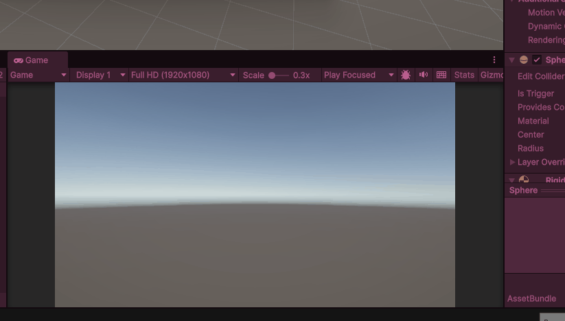
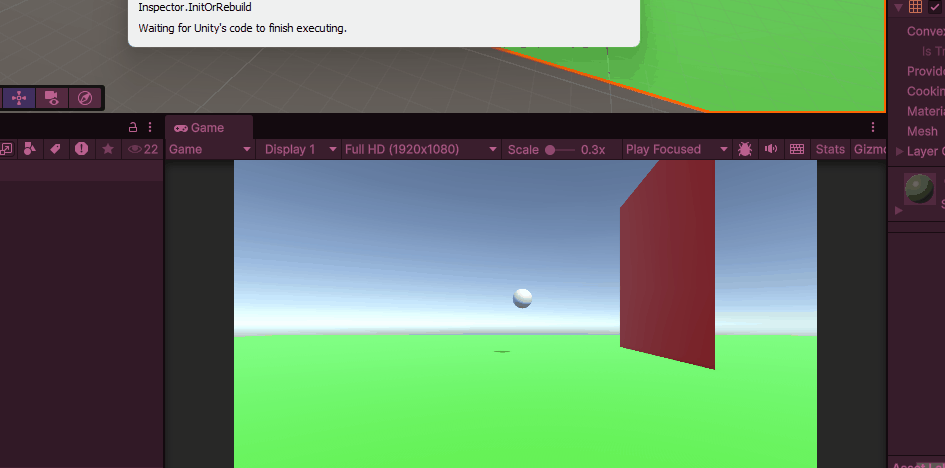
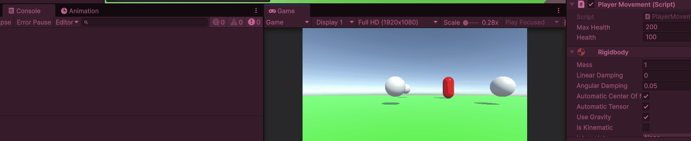

# opdracht 1.1 ballspawner

heb geoevend met mats functions methods parameters and return types

# Oprdacht 1.2 tower spawned als je klikt

Heb goefend met classes object en instanties

# oefening add force

heb goefend met de verschillende force functies en met colliders

# oefening if else

heb geofend met if else statements

# oefening getcomponent en colliders

heb geoefend met getcomponent en colliders en if else