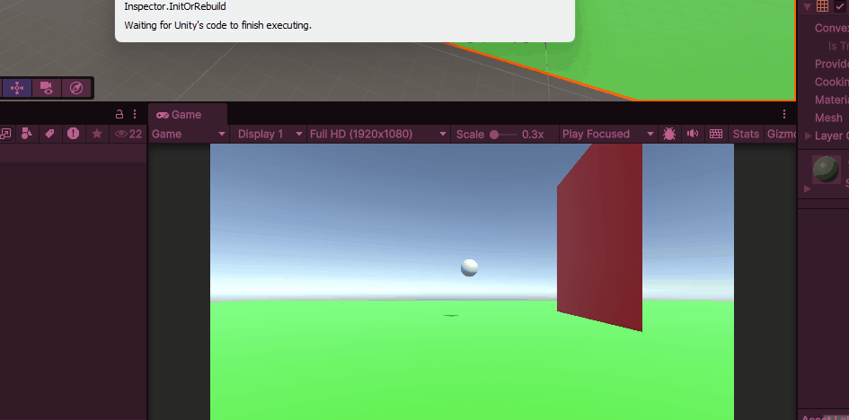

opdracht 1.1 ballspawner
heb geoevend met mats functions methods parameters and return types

Oprdacht 1.2 tower spawned als je klikt

Heb goefend met classes object en instanties

oefening add force

heb goefend met de verschillende force functies en met colliders

oefening if else

heb geofend met if else statements